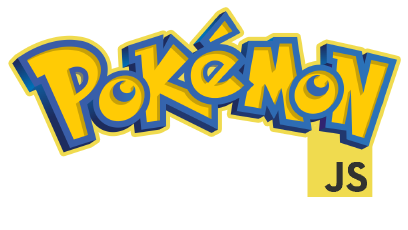

A third generation Pokemon game written in Javascript using [phaser.io](http://phaser.io/). Inspired by [Pokemon essentials](http://pokemonessentials.wikia.com/wiki/Pok%C3%A9mon_Essentials_Wiki) and this project aims to be another tool alternive to fans to make pokemon fan games. You can se the demo here [https://pkmnjs.herokuapp.com/](https://pkmnjs.herokuapp.com/)

## Getting Started

These instructions will get you a copy of the project up and running on your local machine for development and testing purposes.

### Prerequisites

* Node js and npm (download [here](https://nodejs.org/en/download/))
* Git (Optinal) (download [here](https://git-scm.com/downloads))
 
 
### Installing

A step by step series of examples that tell you have to get a development env of Pokmeonjs running

First copy the ropository to your machine.

```
git clone https://github.com/andarms/PokemonJS.git
```

Then enter in the project directory and intall the nmp dependencies

```
cd PokemonJs
npm install
```
When all the pakages are installed you can run  PokemonJS

```
npm run dev
```

## Authors

* **Adrian Manjarres** 

## License

This project is licensed under the MIT License - see the [LICENSE](LICENSE) file for details

## Acknowledgments

* [@maruno42](https://twitter.com/maruno42), the the guy in charge of the RMXP mod Pokémon Essentials. Most graphics are taken from the pokemon essentials project.
* [@LukaSJ0](https://twitter.com/LukaSJ0), his work on the Elite Battle Add on has inspired me.
